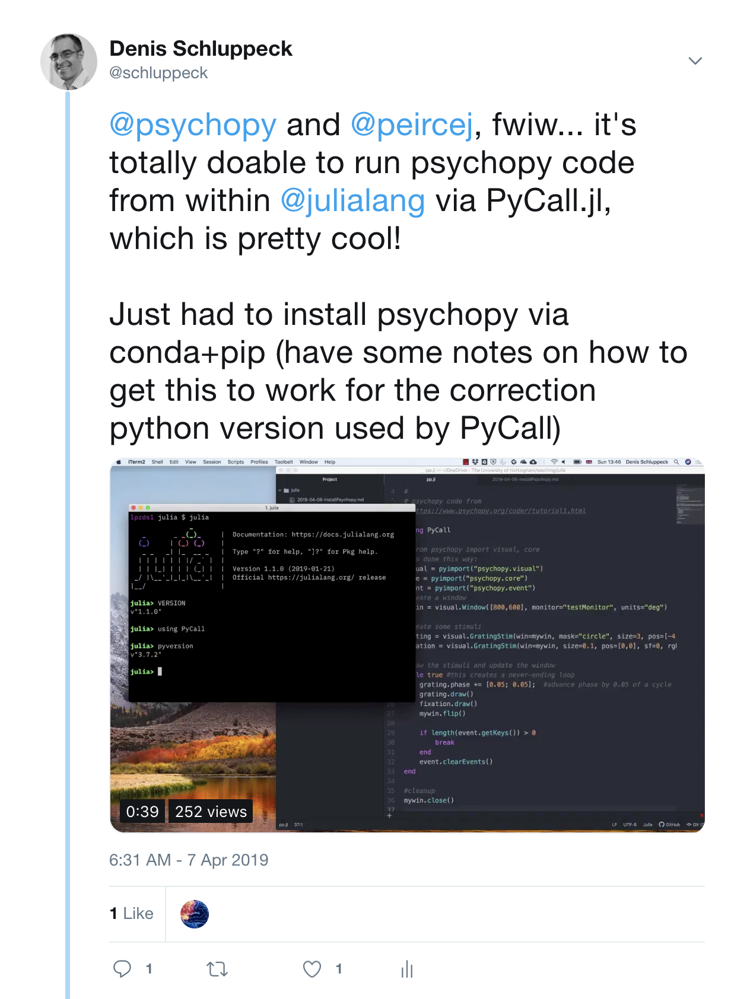

# Psychopy install from within julia



<blockquote class="twitter-tweet" data-lang="en"><p lang="en" dir="ltr"><a href="https://twitter.com/psychopy?ref_src=twsrc%5Etfw">@psychopy</a> and <a href="https://twitter.com/peircej?ref_src=twsrc%5Etfw">@peircej</a>, fwiw... it&#39;s totally doable to run psychopy code from within <a href="https://twitter.com/JuliaLang?ref_src=twsrc%5Etfw">@julialang</a> via PyCall.jl, which is pretty cool!<br><br>Just had to install psychopy via conda+pip (have some notes on how to get this to work for the correction python version used by PyCall) <a href="https://t.co/aOcHJCYkch">pic.twitter.com/aOcHJCYkch</a></p>&mdash; Denis Schluppeck (@schluppeck) <a href="https://twitter.com/schluppeck/status/1114883361586196480?ref_src=twsrc%5Etfw">April 7, 2019</a></blockquote>

<!-- <script async src="https://platform.twitter.com/widgets.js" charset="utf-8"></script> -->


Following install instructions from www.psychopy.org, I managed to get some sample applications to run from within ``julia``. NB: at this point this has only been tested for ``code``, under a recent version of ``macOS``, ``julia v"1.1.0"``, and ``PyCall.jl`` compiled for ``python v"3.7.2"`` (not experiments made in ``Builder``). But it's kind of cool that this all works out of the box!


ds 2019-04-07

- https://julialang.org/
- https://www.psychopy.org/

## install instructions, julia version

Installing ``PsychoPy`` for the command line

> with some help from PyCall.jl dicourse page:
> https://discourse.julialang.org/t/pycall-pre-installing-a-python-package-required-by-a-julia-package/3316/16

You will probably first have to install ``Conda.jl`` and ``PyCall.jl`` first.

```julia
using Pkg
# ] to get into REPL mode for Pkg management
add Conda
add PyCall
```

Then you are ready to do to the ``PsychoPy`` install for the command line

```julia
using Conda, PyCall

println("Running dependency install for the psychopy package.")

# add conda packages like this
println("via conda...")

Conda.add(["numpy", "scipy", "matplotlib", "pandas", "pyopengl", "pillow", "lxml",
"openpyxl", "xlrd", "configobj", "pyyaml", "gevent", "greenlet",
"msgpack-python", "psutil", "pytables",
"requests[security]",  "cffi",  "seaborn",  "wxpython",  "cython",
"future", "pyzmq", "pyserial"]
)

# instead of conda -c , add a channel first
Conda.add_channel("conda-forge")
Conda.add(["pyglet", "pysoundfile", "python-bidi", "moviepy", "pyosf"])

# add the following NOT via conda, via pip
println("via pip...")

# Change that to whatever packages you need.
PACKAGES = ["zmq", "json-tricks", "pyparallel", "sounddevice", "pygame", "pysoundcard", "psychopy_ext", "psychopy"]

# Use eventual proxy info
proxy_arg=String[]
if haskey(ENV, "http_proxy")
    push!(proxy_arg, "--proxy")
    push!(proxy_arg, ENV["http_proxy"])
end

# Import pip
try
    @pyimport pip
catch
    # If it is not found, install it
    println("Pip not found on your sytstem. Downloading it.")
    get_pip = joinpath(dirname(@__FILE__), "get-pip.py")
    download("https://bootstrap.pypa.io/get-pip.py", get_pip)
    run(`$(PyCall.python) $(proxy_arg) $get_pip --user`)
end

println("Installing required python packages using pip")
run(`$(PyCall.python) $(proxy_arg) -m pip install --user --upgrade pip setuptools`)
run(`$(PyCall.python) $(proxy_arg) -m pip install --user $(PACKAGES)`)
```

## then try it out

I have a ``julia`` alias in my ``.bash_profile`` to make calling it in Terminal easier:

```bash
alias julia='/Applications/Julia-1.1.app/Contents/Resources/julia/bin/julia'
```

Then ``julia`` can be called from Terminal. Once there... the usual stuff applies. If you want to use a package/library include it with ``using`` and then you are off.

```julia
using PyCall

# from psychopy import visual, core
# is done this way:
visual = pyimport("psychopy.visual")
core = pyimport("psychopy.core")
event = pyimport("psychopy.event")

#create a window
mywin = visual.Window([800,600], monitor="testMonitor", units="deg")
```

Check out two small sample programs to demonstrate how this works:

- [psychopy tutorial 1 - display a moving grating](pp.jl)
- [sound example](sp.jl) h/t https://github.com/lindeloev/psychopy-course


## in python this was:

The python version of the installs

```bash
conda create -n psypy python=2.7
conda activate psypy
conda install numpy scipy matplotlib pandas pyopengl pillow lxml openpyxl xlrd configobj pyyaml gevent greenlet msgpack-python psutil pytables requests[security] cffi seaborn wxpython cython future pyzmq pyserial
conda install -c conda-forge pyglet pysoundfile python-bidi moviepy pyosf
pip install zmq json-tricks pyparallel sounddevice pygame pysoundcard psychopy_ext psychopy
```
